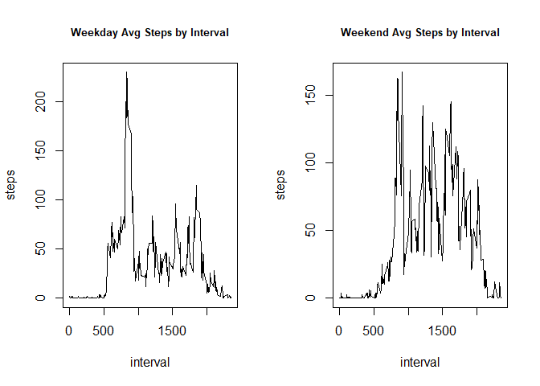

## Loading and preprocessing the data

Reading in file, loading necessary libraries, converting date from character to date format


```r
activity <- read.csv("activity.csv")
```


```r
 library(dplyr)
```

```
## 
## Attaching package: 'dplyr'
```

```
## The following objects are masked from 'package:stats':
## 
##     filter, lag
```

```
## The following objects are masked from 'package:base':
## 
##     intersect, setdiff, setequal, union
```

```r
 library(ggplot2)
```


```r
activity$date <- as.Date(activity$date,format = "%Y-%m-%d")
```
  


## What is mean total number of steps taken per day?

First, we want to calculate total steps taken each day.  This can be done by filtering out NAs, grouping by date, and creating a table by mean steps


```r
totalsteps <- activity %>% group_by(date) %>% filter(!is.na(steps)) %>% summarise(sum(steps))
totalsteps <- rename(totalsteps,steps='sum(steps)')

totalsteps
```

```
## # A tibble: 53 x 2
##    date       steps
##    <date>     <int>
##  1 2012-10-02   126
##  2 2012-10-03 11352
##  3 2012-10-04 12116
##  4 2012-10-05 13294
##  5 2012-10-06 15420
##  6 2012-10-07 11015
##  7 2012-10-09 12811
##  8 2012-10-10  9900
##  9 2012-10-11 10304
## 10 2012-10-12 17382
## # ... with 43 more rows
```

Next we graph number of steps from the previously created table into a histogram and see that there's a semi-normal distribution of steps per day


```r
ggplot(data=totalsteps,aes(x=steps)) + 
               geom_histogram()
```

```
## `stat_bin()` using `bins = 30`. Pick better value with `binwidth`.
```

<!-- -->

The observied mean and median of the total number of steps is as shown below.  They are very close to each other, showing that there is not much skew to the distribution.


```r
mean(totalsteps$steps)
```

```
## [1] 10766.19
```

```r
median(totalsteps$steps)
```

```
## [1] 10765
```
  

## What is the average daily activity pattern?

Here, we first create a table with mean steps taken for each interval of time and assign it to a new object.  Next, we plot it on a line graph using base graphics.


```r
fiveminsteps <- activity %>% group_by(interval) %>% filter(!is.na(steps)) %>% summarise(mean(steps))
fiveminsteps <- rename(fiveminsteps,intsteps='mean(steps)')

with(fiveminsteps,plot(interval,intsteps,type="l"))
```

<!-- -->

It looks like people do the most walking earlier in the early-mid morning.  To figure out which interval sees the maximum amount of walking, we subset the table to the row where intsteps is at max.  8:35 appears to be the peak walking time.


```r
fiveminsteps[fiveminsteps$intsteps==max(fiveminsteps$intsteps),]
```

```
## # A tibble: 1 x 2
##   interval intsteps
##      <int>    <dbl>
## 1      835     206.
```
  

## Imputing missing values

Next, we will deal with missing values.  We start by taking a count of the missing values.  Looks like there are 2,304.


```r
sum(is.na(activity$steps))
```

```
## [1] 2304
```

To replace them with relevant data, we merge on the fiveminsteps dataframe in a new activitymiss dataframe and then set the missing values in steps equal to the average steps for that interval.


```r
activitymiss <- merge(activity,fiveminsteps,by.x = "interval",by.y = "interval")
activitymiss[is.na(activitymiss$steps),2] <- activitymiss[is.na(activitymiss$steps),4]
```

Is there any difference now in our calculated mean and median total number of steps taken per day? Let's start with a histogram


```r
totalstepsNA <- activitymiss %>% group_by(date) %>% filter(!is.na(steps)) %>% summarise(sum(steps))
totalstepsNA <- rename(totalstepsNA,steps='sum(steps)')

ggplot(data=totalstepsNA,aes(x=steps)) + 
               geom_histogram()
```

```
## `stat_bin()` using `bins = 30`. Pick better value with `binwidth`.
```

<!-- -->


```r
mean(totalstepsNA$steps)
```

```
## [1] 10766.19
```

```r
median(totalstepsNA$steps)
```

```
## [1] 10766.19
```

Comparing to previous values, we see that mean and median have changed very little.  The distribution of steps has changed slightly, but the overall shape is the same.
  

## Are there differences in activity patterns between weekdays and weekends?

To answer this question, we first create a variable with the weekday of the date.  Then we add a factor based on whether the weekday is a weekend day or weekday.


```r
activitymiss$weekday <- weekdays(activitymiss$date)

activitymiss$weekfactor <- ifelse(activitymiss$weekday == 'Sunday' | activitymiss$weekday == 'Saturday',"weekend","weekday")
```

Then we need to create a new table averaging steps-per-interval across all weekdays and all weekend days


```r
wdayintervalsteps <- activitymiss %>% group_by(weekfactor,interval) %>% summarise(mean(steps))
wdayintervalsteps <- rename(wdayintervalsteps,steps='mean(steps)')

wdayintervalsteps
```

```
## # A tibble: 576 x 3
## # Groups:   weekfactor [2]
##    weekfactor interval  steps
##    <chr>         <int>  <dbl>
##  1 weekday           0 2.25  
##  2 weekday           5 0.445 
##  3 weekday          10 0.173 
##  4 weekday          15 0.198 
##  5 weekday          20 0.0990
##  6 weekday          25 1.59  
##  7 weekday          30 0.693 
##  8 weekday          35 1.14  
##  9 weekday          40 0     
## 10 weekday          45 1.80  
## # ... with 566 more rows
```


And now, we will look at differences in weekdays vs weekends via a time series plot


```r
par(mfrow=c(1,2))
with(filter(wdayintervalsteps,weekfactor=="weekday"),plot(interval,steps,type = "l",main = "Weekday Avg Steps by Interval",cex.main = .8))
with(filter(wdayintervalsteps,weekfactor=="weekend"),plot(interval,steps,type = "l", main = "Weekend Avg Steps by Interval",cex.main = .8))
```

<!-- -->

In agreement with what we might expect, there is a marked difference in the pattern of steps between weekdays and weekends.  In the former, we see a spike as people exercise and/or go to their jobs in the morning.  On the weekends, we see steadier (and higher) activity through out the day, as people are not sitting for hours at a desk.


